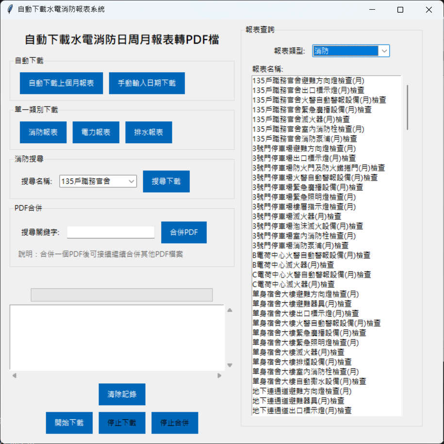
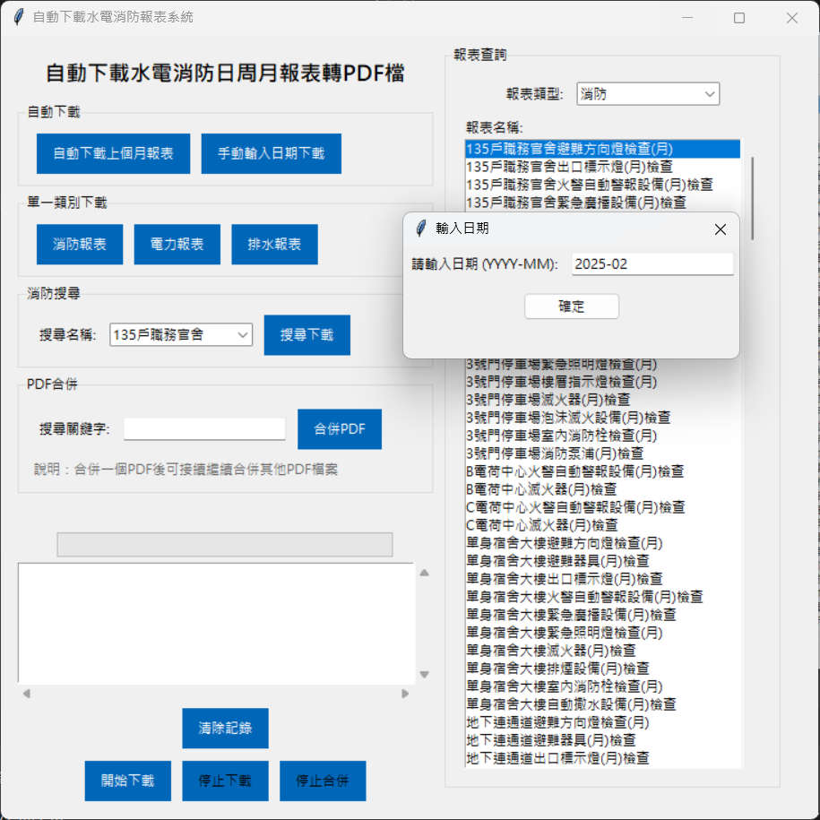

# 臺北榮總水電消防每月報表輸出html轉pdf

**問題**
沒有建立2025-03 資料夾會下載失敗，正常會自動建立


**設計理念**
- 設計新UI
  * 軟體介面
    * 消防
    * 電力
    * 排水
  * 

**主要功能：網頁轉換成PDF檔案**

其他網站數據，請自行修改為其他需轉換的數據資料，以下會說明如何建立數據

## 更新資料庫
* 202302 data.json 新增消防長青樓api資料
* 202401 data.json 新增消防手術室大樓api資料

##  api資料結構
- 以下每個API是固定不變的，只需改變年月可取得需要棟別類型的資料
    - https://vghtpe-ue.httc.com.tw/Report6/16/2022-05/16/32  135戶職務官舍避難方向燈檢查(月)
    - https://vghtpe-ue.httc.com.tw/Report6/138/2022-05/138/155  135戶職務官舍出口標示燈(月)檢查
    - https://vghtpe-ue.httc.com.tw/Report6/272/2022-05/256/298  135戶職務官舍火警自動警報設備(月)檢查
    - https://vghtpe-ue.httc.com.tw/Report6/274/2022-05/383/417  135戶職務官舍緊急廣播設備(月)檢查
    - https://vghtpe-ue.httc.com.tw/Report6/86/2022-05/86/102  135戶職務官舍滅火器(月)檢查
    - https://vghtpe-ue.httc.com.tw/Report6/128/2022-05/128/144  135戶職務官舍室內消防栓檢查(月)
    - https://vghtpe-ue.httc.com.tw/Report6/273/2022-05/257/299  135戶職務官舍消防泵浦(月)檢查
### 手動建立data(資料數據)
* 例子：**/Report6/16/2022-05/16/32**
    * name = `135戶職務官舍避難方向燈檢查(月)`，檔案名稱以name為主
    * api_1 =  `"/16/"`，取前面`/16/`
    * "api_2" : `"/16/32"`  ，取後面`/16/32`

```
{
    "squadName" : "每日巡檢紀錄",
    "Fire_Equipment" : [
      {
        "name" : "135戶職務官舍避難方向燈檢查(月)",
        "api_1" : "/16/",
        "api_2" : "/16/32"
      },
      {
        "name" : "135戶職務官舍出口標示燈(月)檢查",
        "api_1" : "/138/",
        "api_2" : "/138/155"
      },
      {
        "name" : "135戶職務官舍火警自動警報設備(月)檢查",
        "api_1" : "/272/",
        "api_2" : "/256/298"
      },
      {
        "name" : "135戶職務官舍緊急廣播設備(月)檢查",
        "api_1" : "/274/",
        "api_2" : "/383/417"
      },
      {
        "name" : "135戶職務官舍滅火器(月)檢查",
        "api_1" : "/86/",
        "api_2" : "/86/102"
      },
      {
        "name" : "135戶職務官舍室內消防栓檢查(月)",
        "api_1" : "/128/",
        "api_2" : "/128/144"
      },
      {
        "name" : "135戶職務官舍消防泵浦(月)檢查",
        "api_1" : "/273/",
        "api_2" : "/257/299"
      }
    ]
  }
```

## html to pdf 
* 使用wkhtmltopdf軟體達到html轉pdf，[wkhtmltopdf下載](https://wkhtmltopdf.org/)
* 文檔：[usage-wkhtmltopdf](https://wkhtmltopdf.org/usage/wkhtmltopdf.txt)

## 設定

PDF輸出設定，可看文檔依需求使用 [usage-wkhtmltopdf](https://wkhtmltopdf.org/usage/wkhtmltopdf.txt)
```
options = {
'no-background': None
}
```
## 開發人員專用 call(呼叫使用方法)
* 執行文件：main.py
 - 命令 `python main.py`
 - or `pipenv run python main.py`


## pyinstaller build

build 指令

不推薦該指令編譯

```
pyinstaller main.py --add-data "data.json;." --add-binary "wkhtmltox/bin/wkhtmltopdf.exe;wkhtmltox/bin/"
```
或是

目前推薦請使用這個編譯
設定檔案  build.spec，編譯後複製data.json檔案到跟EXE同資料夾
```
pyinstaller build.spec --clean
```


或是

spec文件設定，加入wkhtmltox、data.jso
```
binaries=[('wkhtmltox/bin/', 'wkhtmltox/bin/')],
datas=[('data.json', '.')],
```

## 新增GUI 


## 新增PDF合併功能
請先輸入 關鍵字 再選擇 PDF檔案

**此功能特別針對 多頁PDF處理**

## 新增 報表查詢
選擇 報表類型 > 點選報表名稱 可下載單一報表PDF

