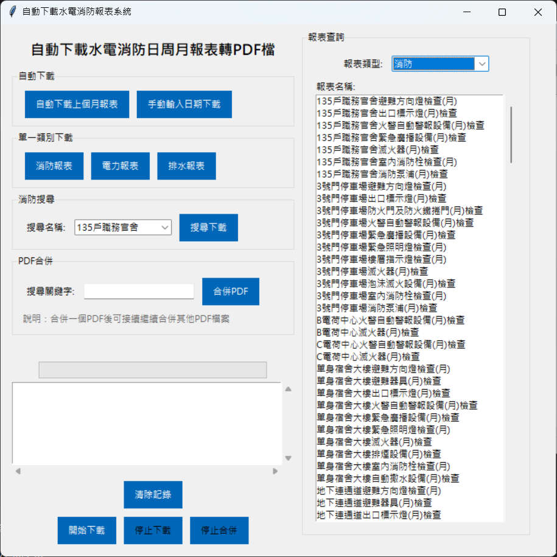
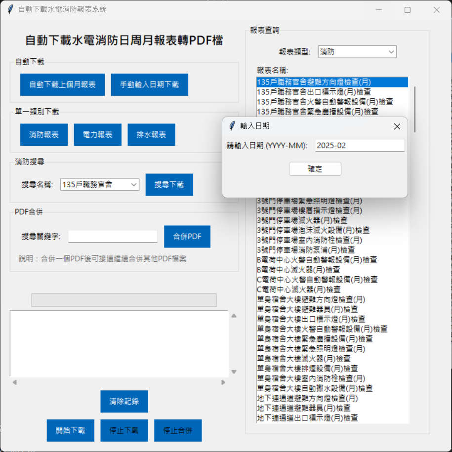

# 臺北榮總水電消防每月報表輸出html轉pdf

**主要功能：網頁轉換成PDF檔案**

其他網站數據，請自行修改為其他需轉換的數據資料，以下會說明如何建立數據

## 目前版本功能

- 下載消防、電力及排水報表，並依類別與月份建立資料夾。
- 在「報表查詢」直接選擇報表、起始月份與結束月份，可一次下載跨月、跨年度報表，例如 `2022-01` 至 `2023-12`。
- 下載前會檢查目標檔案；若同一路徑已有非空白 PDF，會顯示「已存在，跳過下載」，避免重複下載。若檔案大小為 0，則會重新下載。
- 下載進度會平滑更新，並顯示目前處理狀態。
- 可勾選「完成後開啟資料夾」，設定會保留供下次使用；也可隨時按「開啟下載資料夾」手動開啟報表根目錄。
- 支援依關鍵字合併多頁 PDF。

報表預設輸出結構如下：

```text
水電消防報表/
├─ 消防/
│  └─ 2026-02/
│     └─ 二門診滅火器(月)檢查.pdf
├─ 電力/
└─ 排水/
```

## 更新資料庫
* 202302 data.json 新增消防長青樓api資料
* 202401 data.json 新增消防手術室大樓api資料

##  api資料結構
- 以下每個API是固定不變的，只需改變年月可取得需要棟別類型的資料
    - https://vghtpe-ue.httc.com.tw/Report6/16/2022-05/16/32  135戶職務官舍避難方向燈檢查(月)
    - https://vghtpe-ue.httc.com.tw/Report6/138/2022-05/138/155  135戶職務官舍出口標示燈(月)檢查
    - https://vghtpe-ue.httc.com.tw/Report6/272/2022-05/256/298  135戶職務官舍火警自動警報設備(月)檢查
    - https://vghtpe-ue.httc.com.tw/Report6/274/2022-05/383/417  135戶職務官舍緊急廣播設備(月)檢查
    - https://vghtpe-ue.httc.com.tw/Report6/86/2022-05/86/102  135戶職務官舍滅火器(月)檢查
    - https://vghtpe-ue.httc.com.tw/Report6/128/2022-05/128/144  135戶職務官舍室內消防栓檢查(月)
    - https://vghtpe-ue.httc.com.tw/Report6/273/2022-05/257/299  135戶職務官舍消防泵浦(月)檢查
### 手動建立data(資料數據)
* 例子：**/Report6/16/2022-05/16/32**
    * name = `135戶職務官舍避難方向燈檢查(月)`，檔案名稱以name為主
    * api_1 =  `"/16/"`，取前面`/16/`
    * "api_2" : `"/16/32"`  ，取後面`/16/32`

```
{
    "squadName" : "每日巡檢紀錄",
    "Fire_Equipment" : [
      {
        "name" : "135戶職務官舍避難方向燈檢查(月)",
        "api_1" : "/16/",
        "api_2" : "/16/32"
      },
      {
        "name" : "135戶職務官舍出口標示燈(月)檢查",
        "api_1" : "/138/",
        "api_2" : "/138/155"
      },
      {
        "name" : "135戶職務官舍火警自動警報設備(月)檢查",
        "api_1" : "/272/",
        "api_2" : "/256/298"
      },
      {
        "name" : "135戶職務官舍緊急廣播設備(月)檢查",
        "api_1" : "/274/",
        "api_2" : "/383/417"
      },
      {
        "name" : "135戶職務官舍滅火器(月)檢查",
        "api_1" : "/86/",
        "api_2" : "/86/102"
      },
      {
        "name" : "135戶職務官舍室內消防栓檢查(月)",
        "api_1" : "/128/",
        "api_2" : "/128/144"
      },
      {
        "name" : "135戶職務官舍消防泵浦(月)檢查",
        "api_1" : "/273/",
        "api_2" : "/257/299"
      }
    ]
  }
```

## html to pdf 
* 使用wkhtmltopdf軟體達到html轉pdf，[wkhtmltopdf下載](https://wkhtmltopdf.org/)
* 文檔：[usage-wkhtmltopdf](https://wkhtmltopdf.org/usage/wkhtmltopdf.txt)

## 設定

PDF輸出設定，可看文檔依需求使用 [usage-wkhtmltopdf](https://wkhtmltopdf.org/usage/wkhtmltopdf.txt)
```
options = {
'no-background': None
}
```
## 開發人員專用 call(呼叫使用方法)
* 執行文件：main.py

先安裝相依套件：

```powershell
pipenv sync
```

啟動程式：

```powershell
pipenv run python main.py
```

也可在相依套件已安裝的 Python 環境中執行 `python main.py`。


## pyinstaller build

build 指令

不推薦該指令編譯

```
pyinstaller main.py --add-data "data.json;." --add-binary "wkhtmltox/bin/wkhtmltopdf.exe;wkhtmltox/bin/"
```
或是

目前推薦請使用這個編譯
設定檔案 `build.spec`，所需的 `data.json` 與 wkhtmltopdf 已由設定檔一併打包：

```powershell
pipenv run pyinstaller build.spec --clean --noconfirm
```


或是

spec文件設定，加入wkhtmltox、data.jso
```
binaries=[('wkhtmltox/bin/', 'wkhtmltox/bin/')],
datas=[('data.json', '.')],
```

## 新增GUI 


## 新增PDF合併功能
請先輸入 關鍵字 再選擇 PDF檔案

**此功能特別針對 多頁PDF處理**

## 新增 報表查詢
在主畫面右側依序選擇報表類型、報表名稱、起始月份與結束月份，再按「下載選取報表」。日期格式為 `YYYY-MM`，起始月份不可晚於結束月份。

例如選擇「二門診滅火器(月)檢查」，日期設為 `2022-01` 至 `2023-12`，程式會依月份逐一下載兩年份的報表。已存在且檔案大小大於 0 的 PDF 會自動跳過。



## 測試

功能測試位於 `tests/test_report_features.py`，包含日期區間、報表網址、設定保存、開啟資料夾與既有檔案跳過邏輯。

```powershell
pipenv run python -m unittest discover -s tests -v
```

## GitHub Actions 自動發布 Release

專案的 `.github/workflows/release.yml` 會監聽 `v*` 版本標籤。標籤推送到 GitHub 後，Actions 會自動執行測試、編譯 Windows EXE，並建立 GitHub Release 及上傳安裝檔。

日常改版請先把程式碼合併到 `main`，確認測試通過，再建立一個尚未使用過的新版本號：

```powershell
git fetch origin main
$version = "v5.0.1"
git tag $version origin/main
git push origin $version
```

接著到 [GitHub Actions](https://github.com/kobojp/vghtpe_Electronic_inspection_information_webtopdf/actions) 查看執行狀態，完成後可在 [Releases](https://github.com/kobojp/vghtpe_Electronic_inspection_information_webtopdf/releases) 下載 EXE。自動流程正常時，不需要再手動建立 Release。

完整但精簡的固定發布步驟、版本號規則與常見問題，請開啟 [未來固定發布流程操作手冊](./docs/release-guide.html)。
