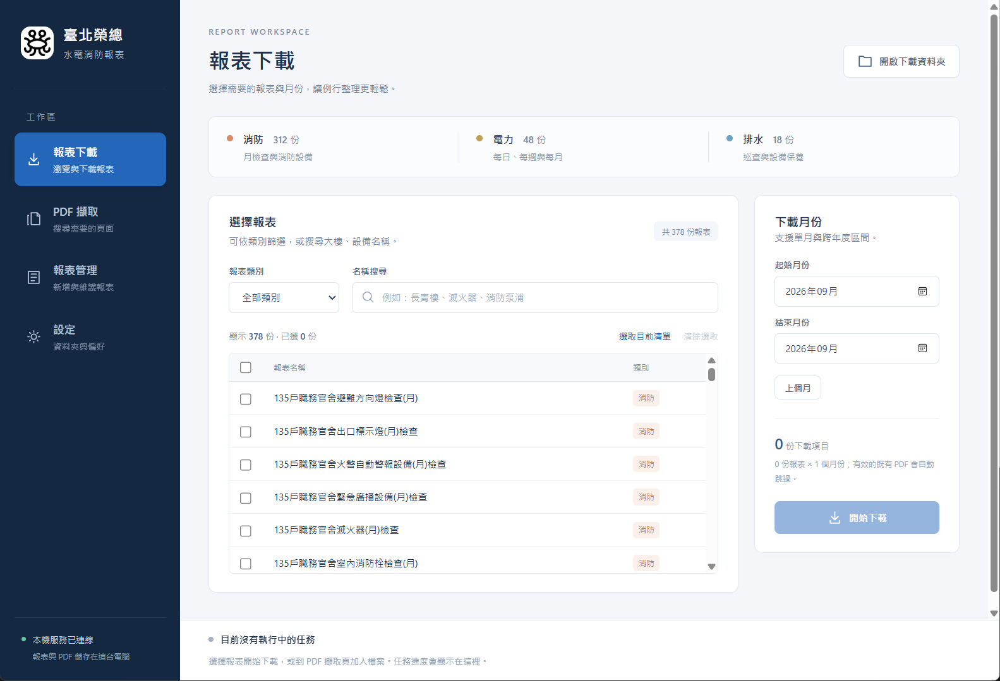

# 臺北榮總水電消防報表下載系統

Windows 桌面工具，集中下載水電消防巡檢報表，並從 PDF 擷取指定內容。介面使用 React + TypeScript + Vite，Python / FastAPI 負責檔案與任務處理，pywebview / WebView2 提供桌面視窗。



## 四個工作頁面

| 頁面 | 可以做什麼 |
| --- | --- |
| 報表下載 | 搜尋、篩選及勾選報表，下載單月或跨月資料 |
| PDF 擷取 | 拖入或選擇多份 PDF，搜尋關鍵字並保存符合頁面 |
| 報表管理 | 新增、修改、刪除外部 data.json 的報表清單 |
| 設定 | 調整輸出資料夾及完成後自動開啟資料夾的偏好 |

底部任務面板顯示進度、成功／跳過／失敗／取消數與近期操作紀錄。切換頁面不會中斷工作；同時間執行一個下載或擷取任務。

## 下載與啟動

從 [GitHub Releases](https://github.com/kobojp/vghtpe_Electronic_inspection_information_webtopdf/releases) 取得 ZIP，完整解壓縮到可寫入的資料夾。新版改版的驗證範圍見 [驗證紀錄](docs/verification.md)；Release 頁面未必已包含本機尚未發布的改動。

```text
程式資料夾/
├─ 水電消防報表下載系統.exe
└─ data.json
```

雙擊 EXE 啟動。使用者不需安裝 Python 或 Node.js；Windows 需具備 [Microsoft WebView2 Runtime](https://developer.microsoft.com/microsoft-edge/webview2/)。報表下載需要連線到報表網站，PDF 擷取處理本機檔案。

**更新程式時保留自己的 data.json，只替換 EXE。** ZIP 裡的 data.json 是首次使用的預設目錄，不要覆蓋已自訂的資料。

## 報表下載

預設目錄包含 378 份報表：消防 312 份、電力 48 份、排水 18 份。資料維護後，介面的數量會依實際清單更新。

1. 選擇報表類別，或用大樓、設備名稱搜尋。
2. 勾選需要的報表；「選取目前清單」會選取篩選後顯示的項目。
3. 設定起始與結束月份，或按「上個月」。
4. 按「開始下載」，在底部面板查看結果。

**下載全部報表**：類別改為「全部類別」、清空搜尋，再按「選取目前清單」。篩選為消防時，此按鈕只選取消防報表。切換篩選不會取消之前的勾選，可用「清除選取」重新選擇。

起訖月份都包含在下載範圍內，支援跨年度。既有 PDF 會先驗證：有效檔案跳過，空白／損壞檔案重新下載。下載使用暫存檔，驗證成功才替換正式檔案，並提供重試、逾時與取消。

進度 100% 代表所有項目處理結束，請同時檢查失敗數。取消後需等待工作與下載子程序結束，才能開始下一個任務。

## PDF 擷取

1. 將一份或多份 PDF 拖入「選擇 PDF 檔案」區域，或按「選擇 PDF」。
2. 已有清單時可繼續拖入；重複路徑自動略過，不同資料夾的同名檔案會保留。
3. 輸入搜尋關鍵字，依需要勾選「保留承商簽核頁」。
4. 按「開始擷取」，完成後開啟擷取資料夾查看結果。

每份來源各產生一份結果；符合頁面維持原順序，承商簽核頁不重複插入。關鍵字可處理文字中的空白與換行，不分大小寫。沒有符合關鍵字時，不會只輸出簽核頁。

非有效 PDF 或無法讀取的拖入檔案會略過並提示；任務執行中不接受新檔案。拖曳須透過桌面程式，瀏覽器預覽無法取得本機完整路徑。

PDF 需要文字層；此版本不含 OCR，掃描影像可能無法搜尋。不同月份的同名輸出使用月份或遞增編號，避免覆蓋。

## 報表管理與資料備份

`data.json` 位於 EXE 同層，沒有嵌入 EXE。可在「報表管理」搜尋及篩選，使用新增、修改或刪除操作維護清單。

表單欄位：

| 欄位 | 說明 | 範例 |
| --- | --- | --- |
| 報表名稱 | 介面顯示及 PDF 檔名 | 135戶職務官舍避難方向燈檢查(月) |
| 報表類型 | 現有七種類型之一 | 消防 |
| 網址參數一（api_1） | 月份前的報表參數 | /16/ |
| 網址參數二（api_2） | 月份後的報表參數 | /16/32 |

七種類型是消防、電力每日／每月／每周、排水每日／每月／每周。參數應取自原有報表網址，月份由下載頁指定。

- 保存前驗證名稱、參數及重複資料。同一大類不可重名，避免下載 PDF 互相覆蓋。
- 保存前將上一版完整資料備份到 `data.json.bak`，再安全替換正式檔案；只保留上一版備份。
- 保留大樓清單、其他根欄位及報表額外欄位。
- 保存後立即同步下載清單、清除舊勾選，保留原月份及搜尋條件。
- 執行中的下載繼續使用啟動時的資料，不受後續清單修改影響。
- 刪除前會顯示報表名稱並要求確認；已下載的 PDF 保留。
- 資料被其他畫面或程式修改時，會拒絕覆蓋並提示「重新載入資料」。

資料檔案與資料夾須可寫入。外部手動修改後，按「重新載入資料」同步。若要還原上一版，先關閉程式，將 `data.json.bak` 複製為 `data.json`。

## 輸出、設定與日誌

預設輸出位於 EXE 同層，可在「設定」改成其他完整路徑：

```text
水電消防報表/
├─ 消防/2026-09/報表名稱.pdf
├─ 電力/2026-09/
└─ 排水/2026-09/

報表合併pdf/20261009/
├─ 報表名稱__2026-08.pdf
└─ 報表名稱__2026-09.pdf
```

`報表合併pdf` 是沿用的資料夾名稱，內容為各份來源的擷取結果。

個人設定位於 `%APPDATA%/VghtpeReportDownloader/settings.json`，日誌位於同目錄的 `logs/error.log`。開發與測試可用 `VGHTPE_STATE_DIR` 改用隔離的設定／日誌目錄；此變數不改變 data.json 的位置。

## 專案結構

```text
main.py                         # 桌面入口
backend/
  app.py                        # 本機 API 與請求驗證
  catalog.py                    # 報表管理、版本比對、備份
  reports.py                    # 月份、報表網址與下載
  pdf_core.py                   # PDF 文字搜尋與擷取
  tasks.py                      # 任務狀態、進度與取消
  config.py                     # 路徑、設定及日誌
desktop/
  launcher.py                   # WebView2、服務與原生對話框
  drop.py                       # PDF 原生拖曳路徑及通知
frontend/
  src/pages/                    # 四個功能頁面
  src/components/               # 共用圖示與任務面板
  src/api/                      # API 呼叫
  src/hooks/                    # 任務查詢
  src/types/                    # TypeScript 契約
  e2e/                          # Playwright 操作流程
tests/                          # Python 核心、API、PDF 測試
docs/                           # 架構、驗證與發布說明
media/2026-10-09.png             # 本文件的介面截圖
.github/workflows/              # Windows 驗證與標籤發布
build.spec                      # PyInstaller EXE 打包
Pipfile / Pipfile.lock           # Python 依賴
frontend/package*.json          # 前端依賴
data.json                       # 外部預設報表目錄
```

AI 開發與操作規則見 [AGENTS.md](AGENTS.md)，模組及 API 說明見 [架構文件](docs/architecture.md)。

## 開發環境

需要 Python 3.13.3、Node.js 24、Pipenv 與 WebView2。從專案根目錄執行：

```powershell
$env:PIPENV_VENV_IN_PROJECT = "1"
python -m pip install pipenv
pipenv verify
pipenv sync --dev
npm.cmd ci --prefix frontend
npm.cmd --prefix frontend run build
pipenv run python main.py
```

即時開發使用兩個終端：

```powershell
# 終端一：Vite
npm.cmd --prefix frontend run dev

# 終端二：桌面視窗及 API
pipenv run python main.py --dev
```

一般桌面模式使用隨機本機連接埠；開發模式使用 API `127.0.0.1:8765` 與 Vite `127.0.0.1:5173`。服務只監聽本機，API 保留工作階段權杖及來源檢查。

## 測試與打包

```powershell
pipenv run python -m unittest discover -s tests -v
npm.cmd --prefix frontend test
npm.cmd --prefix frontend run build
npm.cmd --prefix frontend run test:e2e
pipenv run pyinstaller build.spec --clean --noconfirm
```

Playwright 需要專案內的 `.venv`，測試服務會自動啟動及結束，使用臨時資料，不修改原始 data.json，也不大量下載醫院報表。本機優先使用已安裝的 Chrome，可用 `VGHTPE_TEST_BROWSER` 指定瀏覽器；沒有可用瀏覽器時：

```powershell
Push-Location frontend
npx.cmd playwright install chromium
Pop-Location
npm.cmd --prefix frontend run test:e2e
```

EXE 輸出為 `dist/水電消防報表下載系統.exe`，包含編譯後介面、圖示與 wkhtmltopdf。首次分發時搭配外部 data.json；不分發 node_modules、個人設定、日誌或備份。

打包資源啟動驗證（等待程序結束並檢查返回碼）：

```powershell
if (-not (Test-Path -LiteralPath ".\dist\data.json")) {
    Copy-Item -LiteralPath ".\data.json" -Destination ".\dist\data.json"
}
$env:VGHTPE_STATE_DIR = Join-Path $PWD ".cache\manual-smoke"
pipenv run python -c "import subprocess; subprocess.run(['dist/水電消防報表下載系統.exe','--headless','--smoke-test'],check=True,timeout=60)"
Remove-Item Env:VGHTPE_STATE_DIR
```

以上複製步驟供新建置資料夾使用，已有使用者自訂 data.json 時請保留原檔。

`--headless --smoke-test` 檢查 API、外部目錄與打包介面；`pipenv run python main.py --smoke-test` 另檢查隱藏 WebView2 視窗。自動測試的原生對話框及拖曳通知部分使用替代／模擬，不能當成 Windows 實機操作已通過。詳細通過項目、桌面載入限制及實際網站驗證事項見 [驗證紀錄](docs/verification.md)。

## GitHub Actions 與發布

| 工作流程 | 觸發 | 工作 |
| --- | --- | --- |
| ci.yml | main 的 push、對 main 的 PR | 依賴、Python／前端／瀏覽器測試、EXE 建置及打包資源啟動驗證 |
| release.yml | v* 標籤 push | 驗證 vMAJOR.MINOR.PATCH 格式、執行相同檢查、產生 ZIP、建立 GitHub Release |

失敗時保存 Playwright 診斷檔、PyInstaller 警告及 smoke 日誌，方便查看原因。發布 ZIP 包含 EXE 與外部預設 data.json。

程式、依賴、資料、打包或流程變更發布時，依專案規則確認遠端最新版本、遞增 Patch，推送程式與新的版本 tag；只推送 main 不會建立 Release。整批只有說明文件時可依純文件例外處理。

流程說明見 [發布操作手冊](docs/release-guide.html)。本機修改文件或 workflows 不等於已推送 GitHub、遠端 CI 成功或已發布新版。
